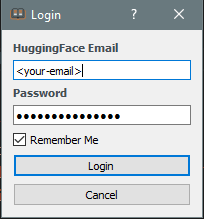
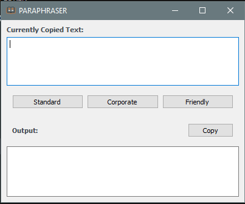

# Paraphrase-Lite Overview

Paraphrase Lite is a straightforward application designed to adjust the tone of your written text while also standardizing and correcting any grammatical errors.


## Running Locally
- Create a virtual environment using `python -m venv .env`.
- Activate the environment with `.env/Scripts/activate`.
- Install required dependencies with `pip install -r requirements.txt`.
- Finally, execute the application with `python script.py`.

## Building the Application (.exe)

```powershell
pyinstaller .\main.spec
```

## Download The latest Exe file


## UI 
### Login UI

### Main UI


## Video Demo

You can watch a demo of the project in action by accessing the video file located at `videos/demo.mp4` in this repository.

